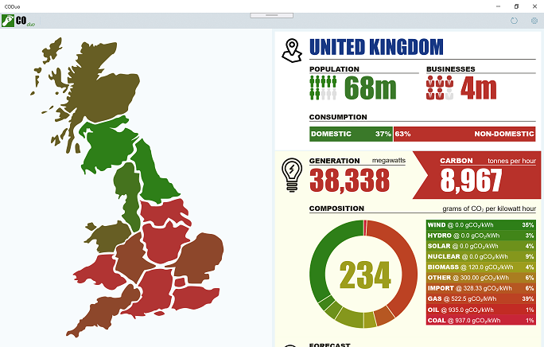
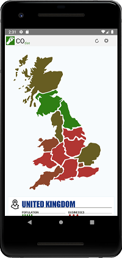
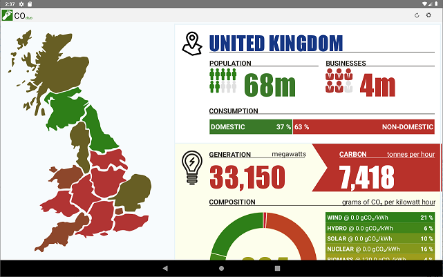

# CO_duo_

* Do you know how the electricity you're using right now was generated?
* Do you know the environmental impact of generating that electricity?
* Do you know how to minimize this environmental impact?

CO_duo_ can help answer all these questions. It's easy to use, "infographic" interface illustrates the current and forecast demand for electricity, how this electricity will be generated and the environmental impact of this generation. With this information you can then see when is best to use energy-intensive appliances (i.e. washing machines, dish washers, tumble dryers, etc) such that environmental impact is reduced.

## Cross Platform

This project uses the [Uno Platform](https://platform.uno/) to create native applications on multiple platforms from a single - UWP/WinUI - codebase. Here are screen shots of CO_duo_ running on various devices:

> CO_duo_ on PC

> CO_duo_ on Android Phone

> CO_duo_ on Android Tablet

CO_duo_ can be found in the following stores:

* [Microsoft App Store](https://www.microsoft.com/en-gb/p/coduo/9php2cf3z997) - For Windows 10 PC, Windows 10 Mobile, XBox, Hololens & Surface Hub  
* [Google Play](https://play.google.com/store/apps/details?id=solutions.onecog.coduo) - For Android version 8 (Oreo) or above on Phone, Tablet or TV
* [Apple App Store] - pending

## Dual-screen devices

CO_duo_ has been designed to capitalize on the opportunities presented by dual-screen devices such as the upcoming Surface Neo & Surface Duo. Below you can see CO_duo_ running on the Surface Neo and how the app becomes much more usable when both screens are used in tandem (click the image to play in YouTube).

## Shared-Source

CO_duo_ is "GNU GENERAL PUBLIC LICENSE v3" licensed with the Common Clause. Essentially you are free to examine the source code and use elements of it in your own projects but don't clone the source and release an app which is "substantially" the same. Please refer to the [license](https://github.com/ibebbs/CODuo/blob/master/LICENSE) for full terms.

Feature requests are welcomed but please raise an issue for discussion before submitting a pull request.